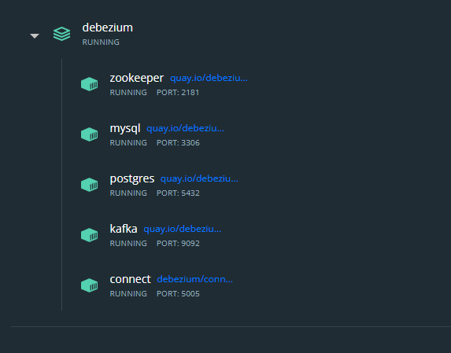
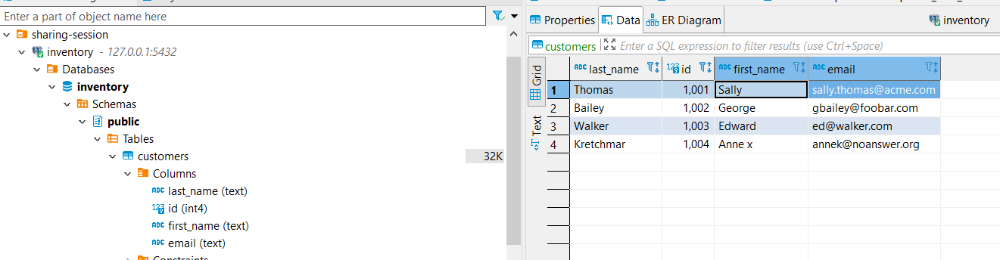

# Debezium

# Step by Step
1. Deploy docker by `docker-compose up -d` and wait until all service running.
   
2. Create Connector to Mysql and Postgres
```shell
# Start PostgreSQL connector
curl -i -X POST -H "Accept:application/json" -H  "Content-Type:application/json" http://localhost:8083/connectors/ -d @jdbc-sink.json

# Start MySQL connector
curl -i -X POST -H "Accept:application/json" -H  "Content-Type:application/json" http://localhost:8083/connectors/ -d @source.json
```
3. Connect to mysql(user=`mysqluser`,password=`mysqlpw`,port=`3306`,host=`127.0.0.1`) and postgres(user=`postgresuser`,password=`postgrespw`,host=`127.0.0.1`,port=`5432`)
4. Try INSERT, UPDATE and DELETE data in `inventory.customers`.




References :
-  [Debezium Unwrap SMT Demo]([https://](https://github.com/debezium/debezium-examples/tree/main/unwrap-smt))
-  [Debezium Documentation](https://debezium.io/documentation/reference/stable/index.html)