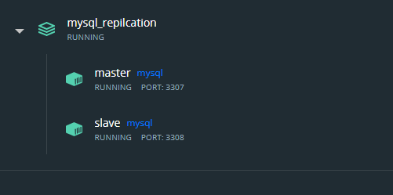
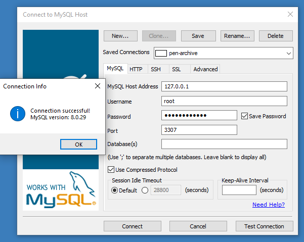
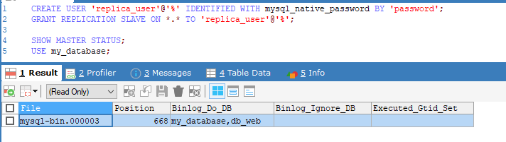
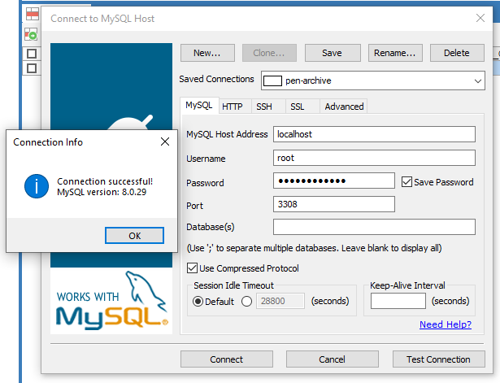
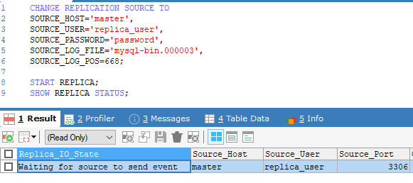

# MYSQL REPLICATION

## Prerequisites
 - docker-compose

## Deploy with Docker-compose
`docker-compose up -d`



## Step by Step 
### On Master
1. Login in Master username `root` and password `Password0987` port `3307` host `127.0.0.1`
   
2. Create user and give grant for replication
   ```sql
   CREATE USER 'replica_user'@'%' IDENTIFIED WITH mysql_native_password BY 'password';
   GRANT REPLICATION SLAVE ON *.* TO 'replica_user'@'%';
   ```

3. Check master status and use database my_database
    ```sql
    SHOW MASTER STATUS;
    USE my_database;
    ```


### On Slave
1. Login in mysql Slave `root` and password `Password0987` port `3308` host `127.0.0.1`

2. Config for replication
    
    ```sql 
    CHANGE REPLICATION SOURCE TO
    SOURCE_HOST='master',
    SOURCE_USER='replica_user',
    SOURCE_PASSWORD='password',
    SOURCE_LOG_FILE='mysql-bin.000003',
    SOURCE_LOG_POS=668;
    ```
3. Start Replication
    ```sql
    START REPLICA;
    SHOW REPLICA STATUS;
    ```



On Master try create table and INSERT, UPDATE and DELETE data.

    CREATE TABLE example_table (
    example_column VARCHAR(30)
    );

    INSERT INTO example_table VALUES
    ('This is the first row'),
    ('This is the second row'),
    ('This is the third row');
And Check the Tabel n datas in slave. :)

References:
- [How To Set Up Replication in MySQL]([https://](https://www.digitalocean.com/community/tutorials/how-to-set-up-replication-in-mysql))
