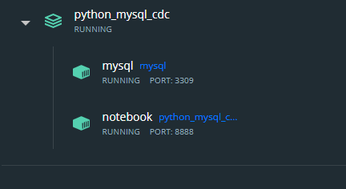
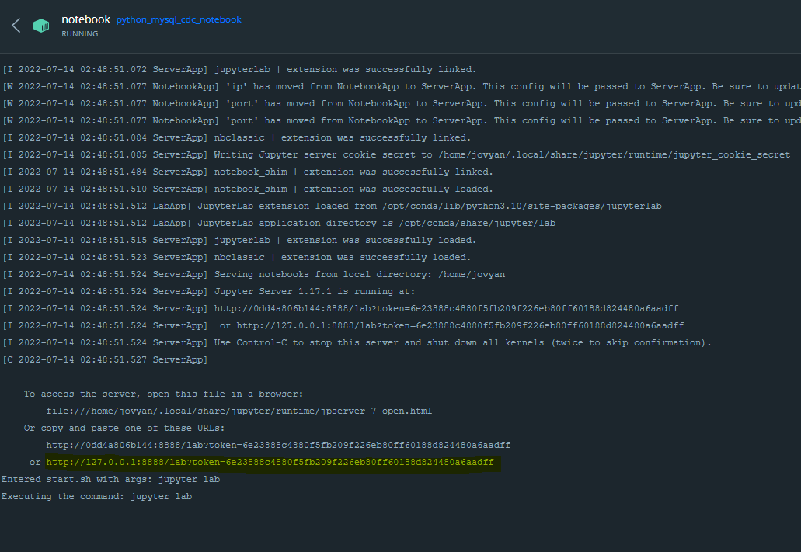
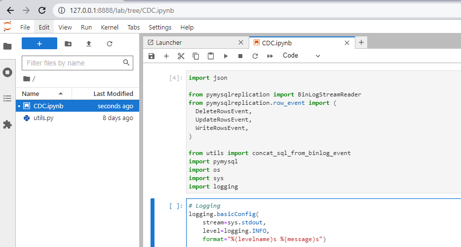
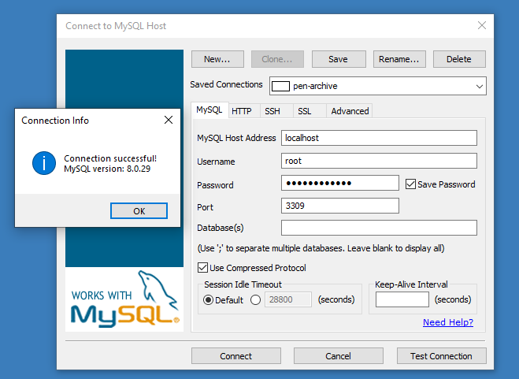
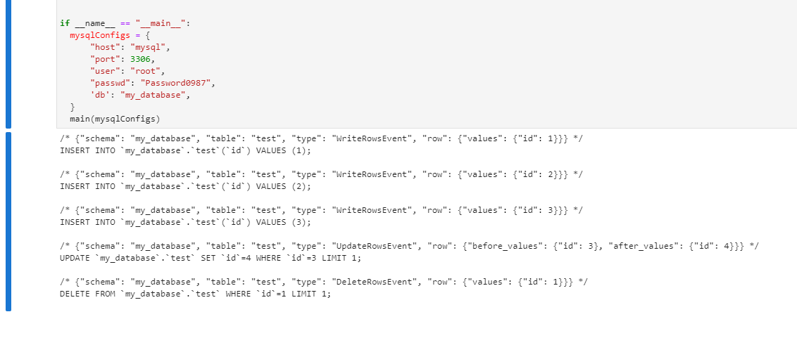

## Prerequisites
 - docker-compose
## How to Use
1. Deploy the docker by `docker-compose up -d`
2. wait until all service running  

3. Clik on notebook pod, to get url n token jupyter notebook

4. And open url+token on browser and open CDC.ipynb and run

1. Connect to mysql `root` and password `Password0987` port `3309` host `127.0.0.1`
   
2. Try Create and table and INSERT, UPDATE and DELETE data and Check the Jupyter Notebook output. :)

References:
- [Python MySQL Replication’s documentation]([https://](https://python-mysql-replication.readthedocs.io/en/latest/))
